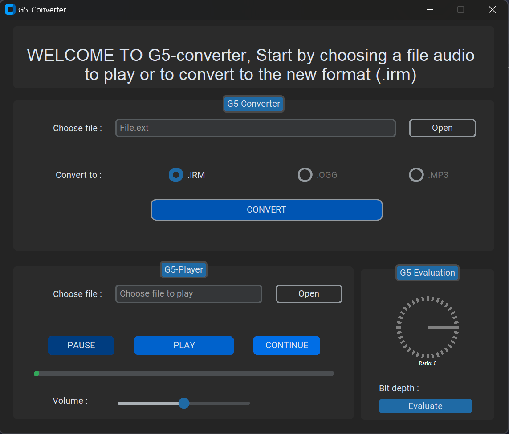

# G5-Converter

G5-Converter is a Python GUI application built using Tkinter and various audio processing libraries. It allows users to play audio files and convert them to a custom compressed format with the ".irm" extension. The application utilizes Huffman coding for compression, offering efficient storage of audio data while maintaining quality. Users can interact with a user-friendly interface to select audio files, convert them to the ".irm" format, play the audio, and evaluate the compression ratio. G5-Converter provides a convenient solution for managing audio files and optimizing storage space.

## Features:
- Play audio files in various formats.
- Convert audio files to the custom ".irm" format using Huffman coding.
- Evaluate compression ratio and quality.
- Intuitive GUI for seamless user experience.

## ScreenShots

